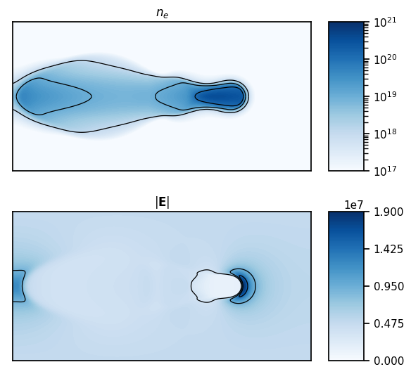

# PlasmaNet

PlasmaNet is an open-source code to study the capability of neural networks to solve the Poisson equation coupled to plasma simulations. It is written in Python using object-oriented paradigms. [PyTorch](https://pytorch.org) is used to implement the neural networks studied in `PlasmaNet`.



## Features

- Flexible and abstract UNet and Multi-Scale architectures implemented allowing easy testing of different architectures
- Object-oriented design for modularity and ease of reusability of building blocks
- Plasma Euler equations integration is implemented for electrons in a plasma oscillation simulation
- Simple Morrow chemistry for streamer propagation (image above) with positive ions, negative ions and electrons in a drift-diffusion formulation
- Linear system solver for the Poisson equation implemented in cartesian geometry for mixed Dirichlet/Neumann boundary conditions (BC), in cylindrical geometry for Dirichlet boundary conditions at left, top, right boundary conditions and Neumann at the axis
- Analytical expansion of the Poisson solution in Fourier series is implemented to study the behavior of the Poisson equation in cartesian coordinates for mixed Dirichlet/Neumann BCs

### Publications

- [Using neural networks to solve the 2D Poisson equation for electric field computation in plasma fluid simulations](https://arxiv.org/abs/2109.13076), *Lionel Cheng, Ekhi Ajuria Illarramendi, Guillaume Bogopolsky, Michael Bauerheim, Benedicte Cuenot*, submitted to Computer & Fluids.
- PlasmaNet: a framework to study and solve elliptic differential equations using neural networks in plasma fluid simulations, *Lionel Cheng, Ekhi Ajuria Illarramendi, Michael Bauerheim, Benedicte Cuenot*, accepted to NeurIPS Workshop "Machine Learning and the Physical Sciences".

Models and configuration files to run experiments from papers can be found by switching to the `papers` branch. The `papers/` directory will appear at the root of the repository. The first paper models and config files are located in the `papers/CAF/` directory where instructions for performance tests with `PETSc` are included. The second paper models and config files are located in the `papers/NeurIPSWorkshop/`.

### Installation

`PlasmaNet` is written as a python library. To install it, go the repository root (where the `setup.py` file is) and run:

```shell
pip install -r requirements.txt
pip install -e .
```

Some environment variables need to be defined for the library (these lines can be added to a `.bashrc` file):

```shell
export ARCHS_DIR=path/to/plasmanet/NNet/archs
export POISSON_DIR=path/to/plasmanet/PoissonSolver/linsystem
```

The first one is to indicate the network architectures directory which are stored in `yaml` files. The second environment variable is for testing.

### Documentation and guides

The documentation can be found online [here](https://plasmanet.readthedocs.io/en/latest/).

To generate locally the html documentation of the package go to `docs/` directory and:

```bash
make html
```

The generated html documentation will be located in `docs/build/html` and to access it open `docs/build/html/index.html` in a web browser.

### Contributions

Contributors are welcome! For questions do not hesitate to send an email to cheng@cerfacs.fr.

### Acknowledgments

@victoresque on GitHub for his [pytorch-template](https://github.com/victoresque/pytorch-template)