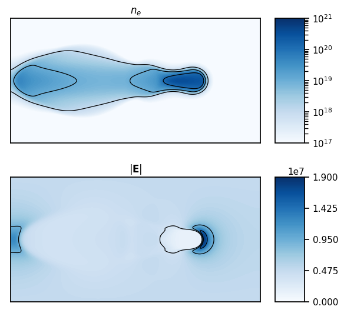

# PlasmaNet

PlasmaNet is an open-source code to study the capability of neural networks to solve the Poisson equation coupled to plasma simulations. It is written in Python using object-oriented paradigms. [PyTorch](https://pytorch.org) is used to implement the neural networks studied in `PlasmaNet`.



## Features

- Flexible and abstract UNet and Multi-Scale architectures implemented allowing easy testing of different architectures
- Object-oriented design for modularity and ease of reusability of building blocks
- Plasma Euler equations integration is implemented for electrons in a plasma oscillation simulation
- Simple Morrow chemistry for streamer propagation (image above) with positive ions, negative ions and electrons in a drift-diffusion formulation
- Linear system solver for the Poisson equation implemented in cartesian geometry for mixed Dirichlet/Neumann boundary conditions (BC), in cylindrical geometry for Dirichlet boundary conditions at left, top, right boundary conditions and Neumann at the axis
- Analytical expansion of the Poisson solution in Fourier series is implemented to study the behavior of the Poisson equation in cartesian coordinates for mixed Dirichlet/Neumann BCs

### Publications

### Installation

`PlasmaNet` is written as a python library working. To install it, go the repository root (where the `setup.py` file is) and run:

```shell
pip install -e .
```

### Documentation and guides

To generate the html documentation of the package go to `docs/` directory and:

```bash
make html
```

The generated html documentation will be located in `docs/build/html` and to access it `docs/build/html/index.html` needs to be opened on a web browser.

### Contributions

Contributors are welcome! For questions do not hesitate to send an email to cheng@cerfacs.fr.

### Acknowledgments

@victoresque on GitHub for his [pytorch-template](https://github.com/victoresque/pytorch-template)