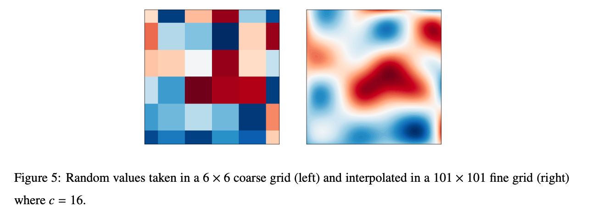
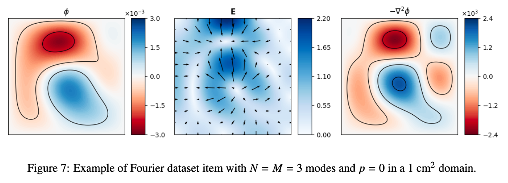

Generating a dataset
======================

The first step will be to create a synthetic dataset on which the network will be trained. To do so, go to:

.. code-block:: shell

   cd path/to/plasmanet/PoissonSolver/datasets

Two types of dataset can be created by default (many more can also be created modifying the existing scripts ...), which are:

*   Random dataset (``rhs_random.py``)
*   Fourier dataset (``rhs_fourier.py``)

On the **random** dataset we will choose a parameter ``c`` that will stablish the minimum structure size on the domain (in number of pixels).
For example, if the desired domain is of size 101x101 and we choose ``c=16``, we will generate a random field of size (101/8 x 101/8 ~ 12x12)
and then reinterpolate it to its original size 101x101. To create a dataset of size ``101x101`` and ``c=16``, two things must be done.

Edit your ``train.yml`` config file to specify the desired output path (preferibly just outside the plasmanet repo),
number of fields in the dataset and domain sizes, and launch the following command:

.. code-block:: shell

   python3 rhs_random.py -c train.yml -nr 16 -nn 101

The **fourier** dataset is created by reconstructing a field randomly choosing the amplitudes of a given number of fourier modes.

.. math::

    𝑅_{𝑛𝑚}(𝑝) ∼ \frac{1}{𝑛^𝑝 + 𝑚^𝑝} 𝑒 𝑛_0 \epsilon_0 U(−1, 1)

We will choose a max number of modes N and a decreasing power factor p that mimics the high-frequency damping
of physical solutions. To create a **fourier** dataset the procedure is quite similar. Correctly modify
the the ``train.yml`` file and then, for a ``101x101``dataset with ``3 fourier modes`` and ``p=0``

.. code-block:: shell

   python3 rhs_random.py -c train.yml -nn 101 -nmax 3 -dp 0

