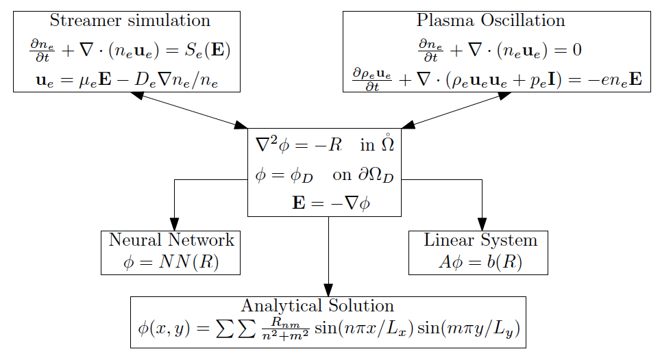

What is PlasmaNet?
===================

``PlasmaNet`` is a python library created to study the resolution of the Poisson equation using Deep Neural Networks.
It is a work done at CERFACS by Lionel Cheng, Ekhi Ajuria and Guillaume Bogopolsky.

Resolution of the Poisson equation inside numerical simulations is a costly task as it involves solving huge linear systems.
``PlasmaNet`` studies the capability of Neural Networks, and especially Convolutional Neural Networks (CNNs) to accelerate
the resolution of this equation.

Cartesian geometries and cylindrical geometries in 2D meshes are studied with two test cases: the plasma oscillation and
the double headed streamer. With those two test cases three ways of solving the Poisson equation are avaible: using a linear system solver,
using an analytical solution or using neural networks. A sketch of the capabilities of ``PlasmaNet`` is shown below.

