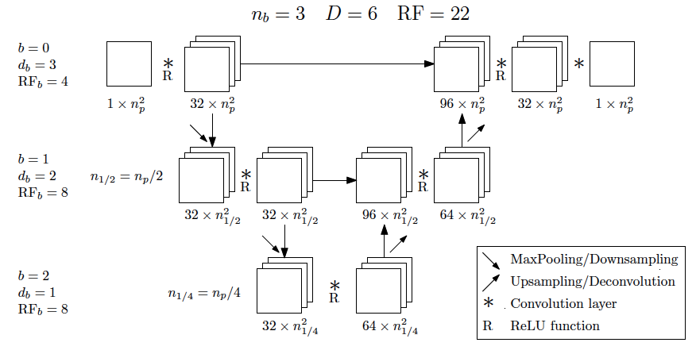
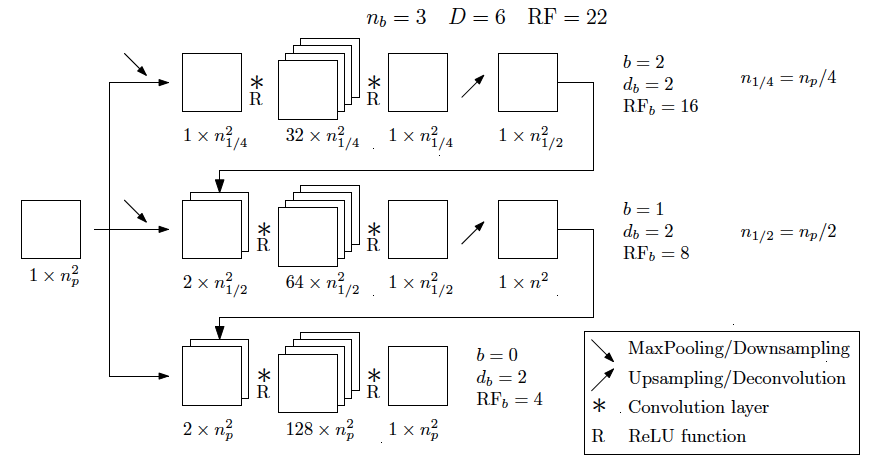

Creating a network, launching and monitoring its training
==========================================================

In this tutorial, we will focus on the definition of a network, then how to train it and monitor its training with TensorBoard.

Creating a network
-------------------

Generic Unet and MultiScale architectures are available at ``path/to/plasmanet/NNet/archs``

    Sketch of UNet

    Sketch of MSNet

A new architecture with the desired features can easily be added. For example, you can generate a new ``.yml`` file
in this same folder and add the number of desired feature maps per scale. Just note that the scale_0 will correspond
to the scale where the resolution is equal to the input size (:math:`N_x \times N_y`), while the highest scale ``scale_n``
matches the images with the lowest resolution (:math:`\frac{N_x}{2^{n-1}} \times \frac{N_y}{2^{n-1}}`).

J'essaye de completer pendant que j'écoute ^^
Tékaté
Je fais des builds au fur et à mesure pour voir à quoi ça ressemble
Et c'est cool pour l'instant?
Yep !

For the **Unet networks**, all scales are a list containing two lists, where the first matches the left side of the Unet
and the second the right side. Only the bottom ``scale_n`` is composed of a single list. The input and output channel
dimensions are **hardcoded** on ``scale_0`` so make sure that they fit the training pipeline.

.. code-block:: yaml

   UNetModified:
      type: 'UNet'
      args:
         scales:
               scale_0: [[1, 2, 3], [11, 2, 1]]
               scale_1: [[3, 3, 3], [7, 8, 8]]
               scale_2: [3, 4, 4]
         kernel_sizes: 3

**MultiScale networks** can also be created following the same logic. The ``scale_0`` corresponds to the scale with
the resolution with the orinal size (:math:`N_x \times N_y`). Note that for the MultiScale, the input field enters
the lowest resolution scale ``scale_n``:

.. code-block:: yaml

   MSNetModified:
      type: 'MSNet'
      args:
         scales:
               scale_0: [2, 2, 2, 3, 2, 2, 1]
               scale_1: [2, 3, 3, 3, 4, 2, 1]
               scale_2: [1, 2, 2, 2, 2, 1]
         kernel_sizes: 3

Further options that can be added on the training yml file.

.. code-block:: yaml

   arch:
      db_file: 'follo.yml'
      name: 'UNetModified'
      args:
         input_res: [101, 401]
         padding_mode: 'custom'

Padding modes can vary between ``zeros``, ``reflect``, ``replicate``, ``circular`` or ``custom``. The ``custom``
padding mode correspond to an example of personalized padding used for cylindrical coordinates, where zero padding
is used for the 3D Dirichlet BC and replication padding is used for the axis. The input domain size needs to be declared
as well, as it can be an integer (for squared domains), or a list with size (height, width)

To check the local and global variables of the network, the ``show_network`` command shows the recetive field,
number of parameters and depth of the entire network as well as for each individual branch:

.. code-block:: shell

    show_network -c modified_network.yml

Launching a training
---------------------

Now that the network and training dataset are created, we simply have to create a Yaml configuration file for the Trainer.
Examples of such can be found in ``PlasmaNet/NNet``.
This file contains multiple blocks, each controlling an aspect of the trainer.

First, we specify the name of the experience which will be used to store the outputs and in TensorBoard as well as the number
of GPUs we want to use:

.. code-block:: yaml

   name: 'test/random_8'            # Experience name
   n_gpu: 1                         # Number of GPUs to use

Then some global parameters are needed, such as the size of the domain, its coordinate system (cartesian or axisymmetric):

.. code-block:: yaml

   globals:                         # Domain sizes and others, used to compute global attributes
      nnx: 101                      # Number of points in x direction
      nny: 101                      # Number of points in y direction
      xmin: 0.0
      xmax: 1.0e-2
      ymin: 0.0
      ymax: 1.0e-2
      coord: 'cart'                 # Coordinates system ('cart' or 'cyl')
      verbosity: 2                  # Output verbosity level

Now, we specify the network we want to use by directly pointing to the ``archs`` database and specifying which network
we want to use in the given database file:

.. code-block:: yaml

   arch:
      db_file: 'unets_ks3_rf100.yml'      # Database file
      name: 'UNet5'                       # Name of the network in the database file
      args:
         input_res: 101                   # Required argument to define the input res of the network

Then, we parametrize the data loader object: its type should correspond to a class defined in ``PlasmaNet/PlasmaNet/nnet/data``,
``args`` should contain all the parameters needed by the class constructor, and the ``pipe_config`` specifies if the dataloader
requires the configuration file.

.. code-block:: yaml

   data_loader:
      type: 'PoissonDataLoader'           # Class name of the wanted dataloader
      data_channels: 1                    # Number of data channels
      pipe_config: True                   # Does the dataloader requires the input file?
      args:
         data_dir: 'path/to/your/dataset' # Dataset path
         batch_size: 64
         shuffle: True                    # Do we randomly reorder the dataset?
         validation_split: 0.2            # if float, fraction of the full dataset, if int, length of validation portion
         num_workers: 4                   # Number of threads reading the dataset (useful for big datasets)
         normalize: 'analytical'          # Normalization of the dataset (max, physical or no)
         alpha: 0.1                       # Coefficient for analytical normalization
         scaling_factor: 1.0e+6           # Supplementary scaling factor for physical_rhs and potential

The initializer and optimizer can also be controlled: the ``type`` and ``args`` field should be filled
according to the PyTorch documentation on initializers and optimizers.

.. code-block:: yaml

   initializer: 'off'                     # Possible Pytorch initializer, cf. PyTorch doc

   optimizer:
      type: 'Adam'
      args:
         lr: 4.e-4                        # Learning rate
         weight_decay: 0
         amsgrad: False                   # Use AMSGrad variant from paper 'On the convergence of Adam and Beyond'

Now, let's define our losses. Many losses are defined in ``PlasmaNet/PlasmaNet/nnet/model/loss.py``, but the ``ComposedLoss``
is probably the most convenient one as it allows you to use all the other losses with a weight for each one,
each component being detailed in the outputs and in TensorBoard (and even the gradients of the losses if you want).
The weights name should correspond to the argument name of each individual subloss.

.. code-block:: yaml

   loss:
      type: 'ComposedLoss'
      pipe_config: True                      # Object initialization require config as first argument
      args:
         loss_list:                          # List of the losses to compose if ComposedLoss is used
               # - InsideLoss
               - DirichletBoundaryLoss
               - LaplacianLoss
               # - EnergyLoss
               # - LongTermLaplacianLoss
         inside_weight: 0.0                  # Weighting of the loss inside the domain, excluding boundaries (float)
         bound_weight: 1.0                   # Weighting of the loss on the boundaries (float)
         elec_weight: 0.                     # Weighting of the loss on the electric field (float)
         lapl_weight: 2.0e+7                 # Weighting of the loss on the Laplacian (float)
         energy_weight: 0.0                  # Weighting of the loss on the energy functional (float)
         lt_weight: 0.0                      # Weighting of the lt loss, whoch only has a Laplacian term
         ltloss_num_procs: 64                # Number of processes for multiprocessing long term loss evaluation

Then we define the metrics to be used. As usual, the metrics should correspond to those defined in
``PlasmaNet/PlasmaNet/nnet/model/metric.py``.

.. code-block:: yaml

   metrics:
      - 'residual'
      - 'inf_norm'
      - 'Eresidual'
      - 'Einf_norm'

Then we define the parameters for the learning rate scheduler:

.. code-block:: yaml

   lr_scheduler:
      type: 'ReduceLROnPlateau'               # Scheduler type, cf. PyTorch doc
      plateau_metric: loss                    # Monitoring metric for ReduceLROnPlateau step()
      args:
         mode: 'min'
         factor: 0.9                         # Amount scheduler reduces LR by (float)
         patience: 50                        # Number of epochs the scheduler waits before reducing LR (int)
         threshold: 3.e-4                    # Relative improvement the scheduler must see (float)
         threshold_mode: 'rel'
         verbose: False

Finally we specify the general trainer parameters such as the number of epochs, the save period,
whether we want the TensorBoard output, etc.

.. code-block:: yaml

   trainer:
      epochs: 20
      save_dir: 'debug/'
      save_period: 20
      plot_period: 20                         # Period to send plots to TensorBoard
      verbosity: 2
      monitor: min val_loss                   # Monitor best model ('method metric', method={min, max}, metric exists)
      early_stop: 200                         # Training is stopped if model performance does not increase for 50 epochs
      tensorboard: true
      histograms: false                       # Save weights and bias histograms (turned off to increase TensorBoard perf)

This example configuration file can be found at ``PlasmaNet/NNet/train.py``

Launch the training by running in either an interactive shell or a batch job with Slurm

.. code-block:: shell

    train_network -c train.yml

.. topic:: Parametric studies

   It is possible to plan a parametric study by defining values for a key, see for example ``PlasmanNet/NNet/cfg_101_unets5.yml``.
   Two modes are available when defining multiple values for multiple argument: *sequential* will consider the tuples of arguments (each
   list must have the same number of values) or *tree* where all the combinaisons are explored.

   .. code-block:: yaml

      description: 'Different UNet5 with varying receptive field'
      mode: 'seq'
      name: ['UNet5/rf100', 'UNet5/rf150', 'UNet5/rf200', 'UNet5/rf300', 'UNet5/rf400',]
      arch/db_file: ['unets_ks3_rf100.yml', 'unets_ks3_rf150.yml', 'unets_ks3_rf200.yml', 'unets_ks3_rf300.yml', 'unets_ks3_rf400.yml']

   Use ``train_networks`` if you want to realise a parametric study as specified above.

Monitoring a training
----------------------

To check in live the evolution of the training, PlasmaNet generates tensorboard logs in the folder where the trainings are saved.
To launch a tensorboard and monitor the training, go to the ``/network/saving/path`` and use the command:

.. code-block:: shell

    tensorboard --logdir=/path/to/dir --port=6123

At this point, a tensorboard will be opened in the remote machine. In order to acces it locally,
open a new terminal in your computer and link the remote host port as follows:

.. code-block:: shell

    ssh  -N -L localhost:8787:localhost:6123 kraken

Then, just open in your favourite web browser the following link: ``http://localhost:8787``