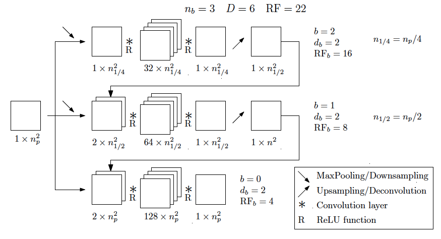

User guide and library capabilities
====================================

The three modules :mod:`PlasmaNet.nnet`, :mod:`PlasmaNet.cfdsolver` and :mod:`PlasmaNet.poissonsolver`
each have a corresponding folder in the root of the directory where these libraries are
used for studies. Simple example runs are given for each functionality.

``CfdSolver/``
*******************

Running the studied fluid simulations of plasma oscillation and double headed streamer.

``euler/covo``
---------------------

Convective vortex case for validating the Euler equations Lax-Wendroff scheme.  The isentropic vortex solution can be launched using

.. code-block:: shell

    euler -c covo.yml

``euler/poscill``
---------------------

Plasma oscillation test case described in [Cheng]_ and ran by the following command

.. code-block:: shell

    plasma_euler -c 101.yml

``scalar/transport``
----------------------

Scalar advection and diffusion are validated on a simple square geometry for a scalar variable :math:`u` that follows

.. math::

    \frac{\partial u}{\partial t} + \nabla \cdot (\mathbf{u} a - D \nabla u) = 0

A robust upwind scheme for advection and a central difference scheme for diffusion are implemented for now. Geometry parameters as well as values of constant velocity and diffusion coefficient can be tuned in the ``scalar.yml``. The associated executable created by the library is ``scalar`` so that a simple simulation can be launched by running

.. code-block:: shell

    scalar -c scalar.yml

``scalar/dh_streamer``
----------------------

Double headed streamer simulation that can be run using

.. code-block:: shell

    streamer -c dh_streamer.yml

``NNet/``
********************

This repository allows to train neural networks from configuration files and post-process the training (plotting things such as metrics and losses). Two main architectures are studied in ``PlasmaNet``: UNet and MSNet architectures. Sketches are showcased below:

.. figure:: figures/unet3_rf.png
    :align: center
    :width: 600

    Sketch of UNet

    Sketch of MSNet

Training can be launched by running

.. code-block:: shell

    train_network -c train.yml

More details on the implementation of the configuration file are found in the developers guide.

``PoissonSolver/``
********************

This repository contains four directories:

``analytical/``
--------------------

Study of the exact solution of the 2D cartesian Dirichlet Poisson problem. The solution relies on the exact Green funtion that is expanded in [Jackson]_.

``datasets/``
--------------------

Generation of datasets for the deep neural networks. The main datasets are ``random`` and ``fourier`` datasets explained in the article. Task-based parallelization using the ``multiprocessing`` is done to speed up the datasets generation. A typical ``random`` can be generated by running

.. code-block:: shell

    python rhs_random.py -c train.yml -nr 8 -nn 101

``linsystem/``
--------------------

Different profiles of right hand side and boundary conditions are considered in this repository and their solutions from linear system solvers are plotted.

``network/``
--------------------

Neural networks are evaluated in this repository. They can be evaluated either on datasets or on specific profiles like the ones presented in ``linsystem/``.

``perfs/``
--------------------

Performance of the different options for solving the Poisson equation is monitored in this repository.

``tests/``
-------------------

Unit tests of Poisson resolution.

.. [Jackson] Classical Electrodynamics, John David Jackson, 1999, John Wiley & Sons.

.. [Cheng] Using neural networks to solve the 2D Poisson equation for electric field computation in plasma fluid simulations, Lionel Cheng, 2021, arXiv preprint arXiv:2109.13076.