# First conclusions on Receptive Field analysis

When studying the Unet behavior, the Receptive field is assumed as
one of the main characteristics that can define the network behavior. 
This first conclusion can be backed up when performing a study of different
Unet architectures, where the receptive field is gradually changed. For example,
if a 3 scale Unet (with kernel size = 3, and trained on a random 8 dataset) 
is analysed, a score stagnation is appreciated when the receptive field matches the entire domain:

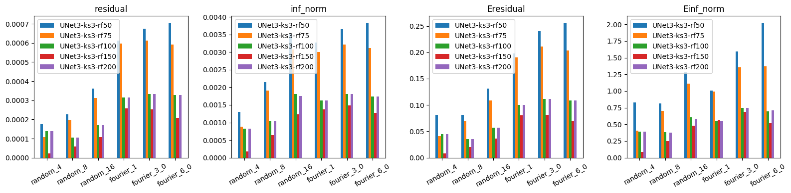

A similar tendecy can be found for the Unet 4 networks:

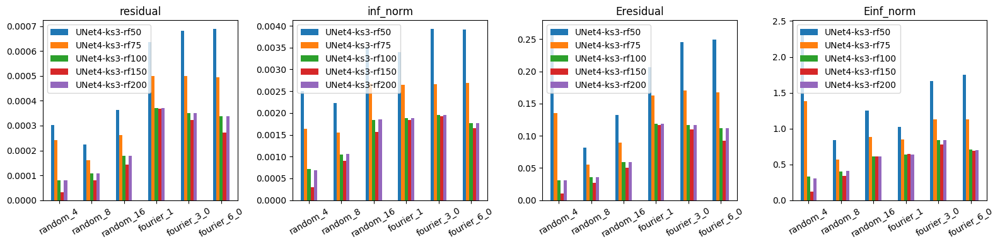

A significative gap is appreciated when the receptive field is "saturated",
 and the accuracy of the networks with RF > 101 stagnates, as the results remain rather constant. 
 This same study carried out with a Unet 5 is not possible, as with a 5 scale 
 architecture the minimum possible receptive field for the Unet network is 93x93. 
 However, if the saturated receptive fields are compared, the results confirm taht 
 further increasing the receptive field does not necessarily yield better results:

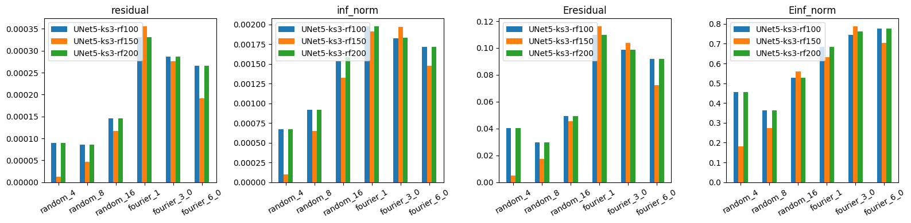

Similar results can be obtained on networks trained on a random 4 dataset:

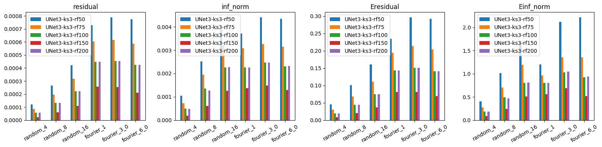
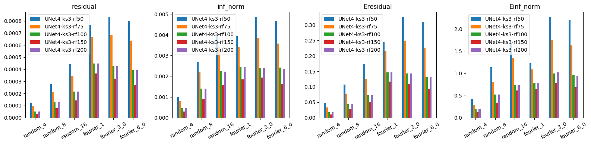
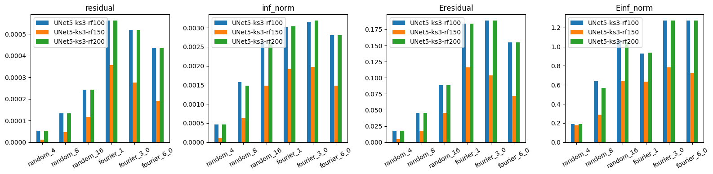

Interestingly the 150 network seems to "work better", ... to be analyzed.

A posisble reason of this accuracy drop when reducing the receptive field 
could be better understand when decomposing the potential fields on Fourier 
modes. When the receptive field is not saturated, the network should not be 
able to capture information that affects the entire domain, thus it should
not be capable of capturing the fundamental Fourier mode. In order to 
confirm this hypothesis, a new Fourier metric is introduced, which 
evaluates the difference between the amplitude of a specific mode 
predicted by the network and the analytical solution:

$$ \varphi_{nm} = |A^{output}_{nm} - A^{target}_{nm} |$$

Thus, when looking at the results of these metric for the random 8 Unet networks:

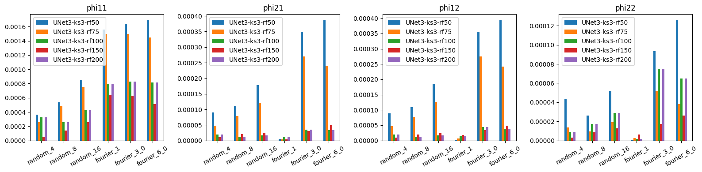

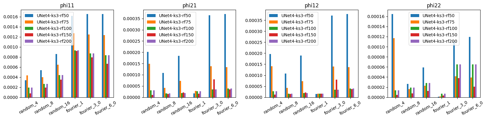

It can be appreciated how the main difference is usually found on the 
fundamental mode, as non saturaded receptive fields a not capable of 
capturing it. Moreover, the 1-2 and 2-1 modes yield a similar result, 
which confirms the statistically simmetric behavior of the network, as 
it does not seem to fuerther stuggle in a particular direction. Moreover, 
the 2-2 mode shows a more equilibrated distribution. For the networks 
not able to capture the basic mode, they probably try to compensate 
this mack tunning inferior modes. Thus, this results in a more 
heteregeneous error distribution. However, it should be noted that 
the amplitude of these cases is smaller than the previous modes, 
thus they tend to be less crucial when reconstructing the potential field.

The importance of the error made on the first Fourier mode is appreciable 
when plotting amplitudes of the modes of both the analytical solution and 
the network output. The following images correspond to the Unet4 networks, 
trained on a random_8 dataset, with a kernel size = 3. These networks are 
tested on an image issued from the training dataset, resulting in the following:

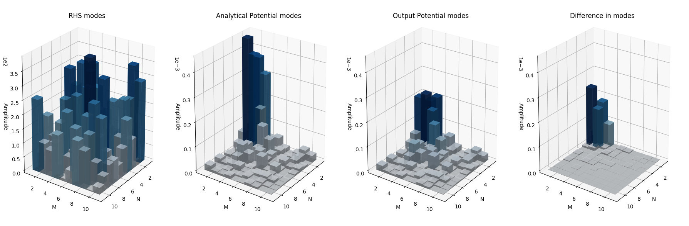

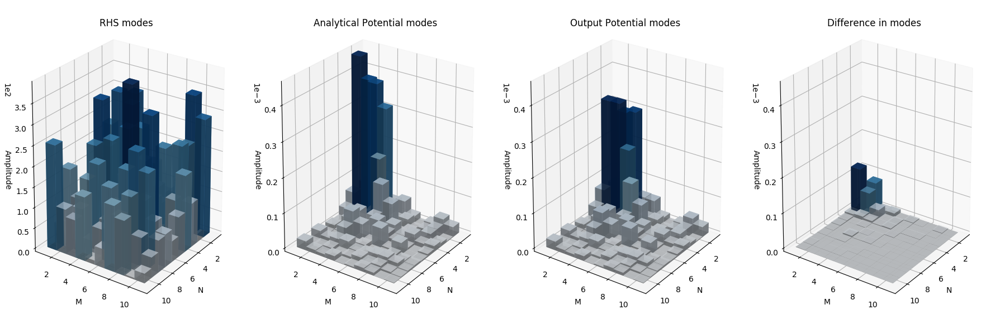

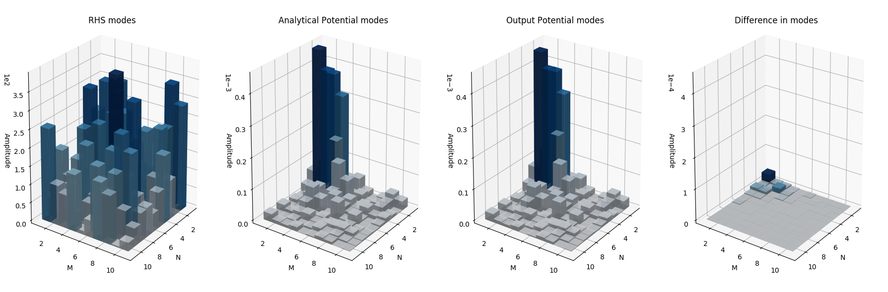

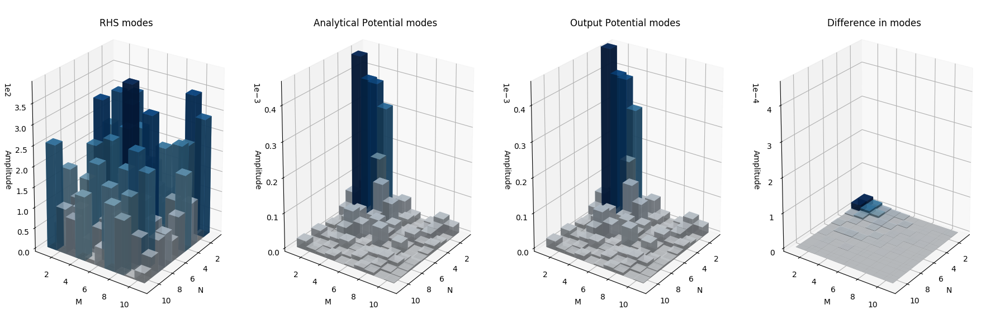

The same tendency is kept by the Unet 3 networks, both trained on 
random_8 and randiom_4 datatsets. The networks with the smallest 
receptive field tend to understimate the first mode, resulting 
in a higher error concentration.

## Kernel size influence

A similar study is carried out, comparing the influence of the kernel size on the network architecture:

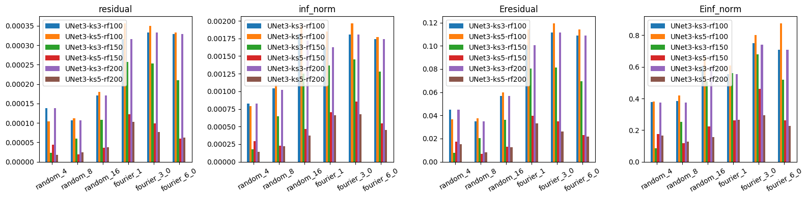

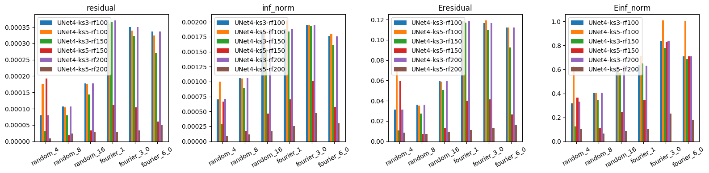

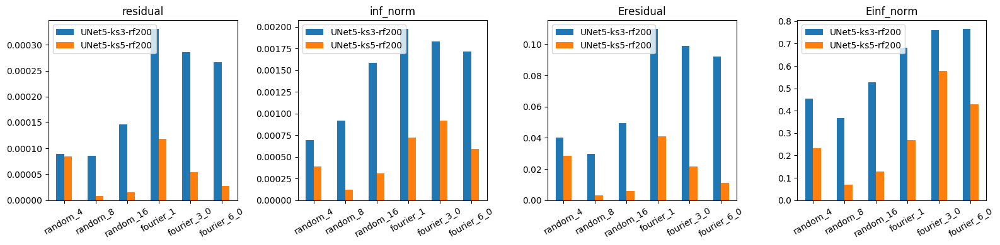

The networks are read two by two, thus the first network will 
corresond to kernel size = 3, whereas the second to kernel size = 5 
and so on. It can be appreciated how for the 100 receptive field the 
results remain quite similar, whereas when incrementing the receptive 
field, increasing the kernel size seems to have a rather positive effect. 
Bigger kernel sizes increase the receptive field faster, thus 
resulting in thiner architectures. These architectures will probably 
learn fastes as they have less convolutions to backpropagte through, 
yielding a higher accuracy during testing. 

## TO BE TESTED ==> If the k=3 networks are trained for longer they should converge towards the same result?

However, when the networks are compared between each other, 
results are quite similar between the 3, 4 and 5 scale networks:

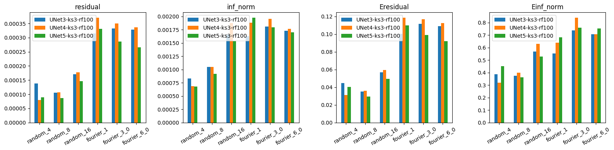

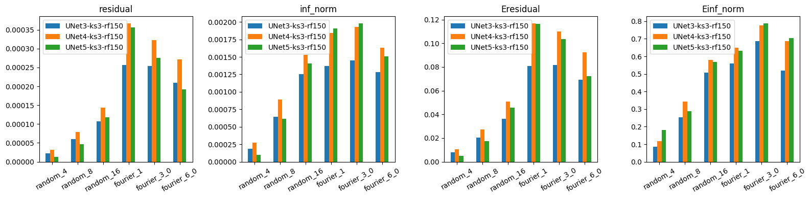

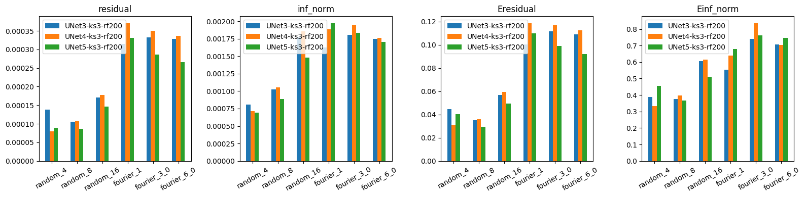

